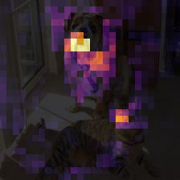
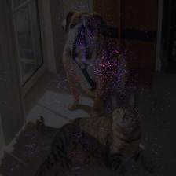
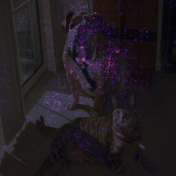
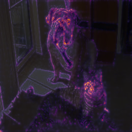

# Saliency Methods

## What are Saliency Methods

**Saliency Methods** or visual explanation methods are methods that generate an explanation map for an image of shape (c x w x h), given a model that can generate predictions for the image and a (predicted) label. The explanation map is then a (c x w x h) array that contains a relevance score for the specific subpixel at that position in the input image. This score is a measure of how important the subpixel is for the label, determined by the given model.

Visual explanations can be used to determine which features in the image a model uses in its prediction. This can then be used to detect bias in a model, detect adversarial attacks against the model and more.

## General Info

All Saliency methods in this library have been tested both on **VGG-16** and **ResNet-50**. While it is impossible to test all possible network configurations, the intention is that these methods work on all models that have the same components as VGG-16 or ResNet-50.

All sample visualisations in this document are generated using a model from TorchVision pre-trained on the ImageNet dataset, and all use the following input image, predicting the class 254 (Pug):

## Implemented Methods

### Occlusion- / Perturbation-based methods

These methods generate an explanation by systematically occluding parts of the original input image and calculating the score difference between 'P(label|occluded_img, model [^1] )' and 'P(label|img, model)' This difference is then used as a measure of relevance for the occluded part. The following methods are implemented in this library:

- Sliding Window Occlusion (Zeiler2014)
- RISE (Petsiuk2018)

| | VGG-16 | ResNet-50|
|-----------|--------|----------|
|RISE| | |
|Occlusion| | 

[^1]:These models don't necessarily need to be Neural Network models.

### Gradient-based Methods
These methods use the gradient as an indication of the relevance of the pixels.

The following methods are implemented in this library:

- Gradient (Simonyan2013)
- Gradient x Input (Shrikumar2017)
- Integrated Gradients (Sundararajan2017)
- FullGradient (Srinivas2019)
- Guided Backpropagation (Springenberg2014)

| | VGG-16 | ResNet-50|
|-----------|--------|--------|
|Gradient | | |
|Gradient x Input | | 
|Integrated Gradients | | 
|FullGradient | | 
|Guided Backpropagation | | 

### CAM-based methods
These methods all follow the same principle, where a computer vision network is divided in two parts : a feature extraction part and a classification part. CAM-methods generate an explanation map by taking the weighted sum of the feature maps at a certain point in the feature extraction part. These methods only differ in the way the weights are calculated.
The following methods are implemented:

- Class Activation Maps (Zhou2016)
- Grad-CAM (Selvaraju2017)
- Score-CAM (Wang2019)
- Grad-CAM++ (Chattopadhyay2017)
- Ablation-CAM (Desai2020)
- Axiom-based Grad-CAM (XGrad-CAM) (Fu2020)

| | VGG-16 | ResNet-50 |
|------|------|--------|
|CAM | Not Supported | Not Supported|
|Grad-CAM| | |
|Score-CAM| | |
|Grad-CAM++| | |
|Ablation-CAM| | |
|XGrad-CAM| | |

### Backpropagation-based methods
These methods generate explanation maps by backpropagating a relevance score using different rules.

| | VGG-16 | ResNet-50 |
|-----|--------|--------|
| LRP| | |

### Composite methods

This repository also contains two composite methods, these are methods that are used to enhance the explanation maps for a given explanation method.

The following methods are implemented:

- Smoothing using Gaussian noise (Smilkov2017)
- Elementwise multiplication with Guided BackPropagation (Springenberg2014, Selvaraju2017)

| | Vgg-16 | ResNet-50 | 
|-------|-------|------|
| Gradient|  | |
| Gradient (+smoothing) |  | 
| Grad-CAM |  | |
| Guided Grad-CAM |  |  |

## Additional tools:

This repository contains implementations of a number of different commonly used evaluation methods for visual explanations.

TODO: more info!

## References
(Chattopadhyay2017) Grad-CAM++: Improved Visual Explanations for Deep Convolutional Networks, Chattopadhyay et al. 2017

(Desai2020) Ablation-CAM: Visual Explanations for Deep Convolutional Network via Gradient-free Localization, Desai & Ramaswamy 2020

(Fu2020) Axiom-based Grad-CAM: Towards Accurate Visualization and Explanation of CNNs, Fu et al. 2020

(Petsiuk2018) Rise : Randomized Input Sampling for Explanation, Petsiuk et al. 2018

(Selvaraju2017) Grad-CAM: Visual explanations from deep networks via gradient-based localization, Selvaraju et al. 2017

(Shrikumar2017) Learning Important Features Through Propagating Activation Differences, Shrikumar et al. 2017

(Simonyan2013) Deep inside convolutional networks: Visualising image classification models and saliency maps, Simonyan et al. 2013

(Smilkov2017) SmoothGrad: removing noise by adding noise, Smilkov et al. 2017

(Springenberg2014) Striving for simplicity, the all convolutional net, Springenberg et al. 2014

(Srinivas2019) Full-Gradient Representation for Neural Network Visualization, Srinivas et al. 2019

(Sundararajan2017) Axiomatic Attribution for Deep Networks, Sundararajan et al. 2017

(Zeiler2014) Visualizing and Understanding Convolutional Networks, Zeiler et al. 2014

(Zhou 2016) Learning Deep Features for Discriminative Localization. (Zhou et al. 2016)

(Wang2019) Score-CAM: Score-Weighted Visual Explanations for Convolutional Neural Networks, Wang et al. 2019